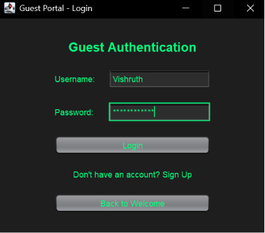
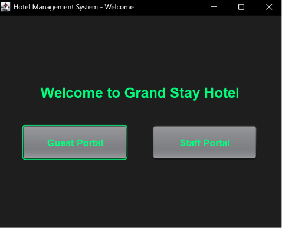
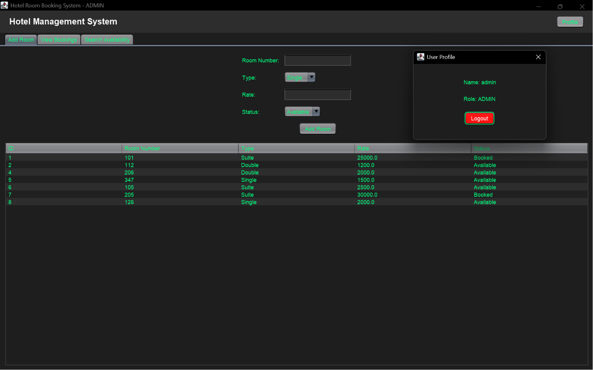
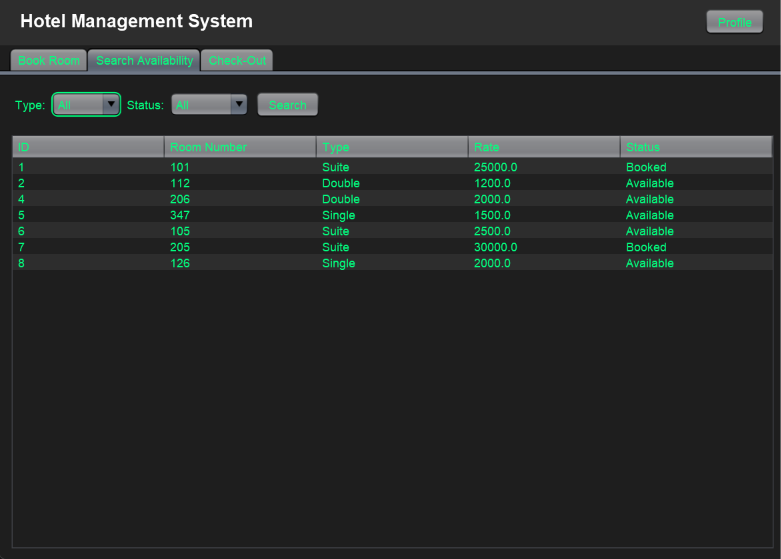
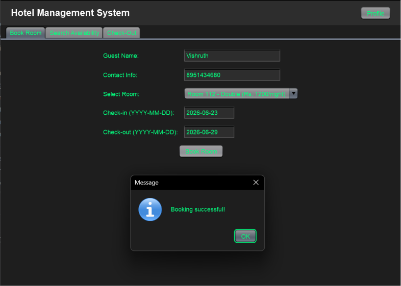
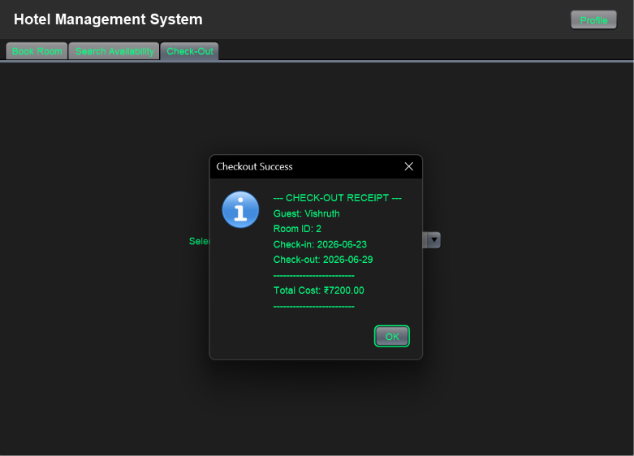

# 🏨 Hotel Room Booking System

A modern, multi-tenant desktop application built with **Java Swing** and **MySQL**. Designed with strict Role-Based Access Control (RBAC), this system provides a secure, dual-portal environment: one tailored for hotel staff to manage inventory, and another for guests to handle their personal reservations and check-outs.

---

## 🖼️ UI Gallery

The system features a professional dark-themed interface with neon green accents, optimized for high visibility and user efficiency.

### 🔐 Authentication & Access Control


**Secure Authentication:** A streamlined login interface featuring strict role-based access control for both Guests and Staff members.



**Role-Based Gateway:** A centralized routing portal that cleanly separates personalized guest services from secure administrative operations.

---

### 💼 Administrative & Staff Operations

**Inventory Control:** A comprehensive administrative interface allowing staff to provision new rooms and manage inventory in real-time.


**Live Room Search:** High-performance search interface for real-time availability tracking and multi-parameter filtering across the hotel inventory.

---

### 🛎️ Guest Services

**Seamless Reservations:** Intuitive booking module with automated guest identification and real-time availability synchronization.


**Automated Billing:** Dynamic check-out system featuring instant stay duration calculation and professional receipt generation.

---

## ✨ Key Features

### 🛡️ Security & Architecture
* **Role-Based Access Control (RBAC):** Distinct interfaces and database permissions for `ADMIN` (Staff) and `USER` (Guests).
* **Secure Provisioning:** Closed signup loop for Staff (database-level provisioning only) and secure registration for Guests with password confirmation.
* **SQL Injection Defense:** Strict implementation of JDBC `PreparedStatement` for all database transactions.
* **Input Validation:** UI-level `DocumentFilter` mechanisms to prevent illegal characters and invalid date entries.

### 💼 Staff Portal (Admin)
* **Inventory Management:** Add new rooms with built-in duplicate-checking.
* **Global Dashboard:** View all active hotel bookings across all guests.
* **Live Search:** Filter and query the entire hotel room inventory in real-time.

### 🛎️ Guest Portal (User)
* **Personalized Booking:** Automatically locks reservations to the authenticated user's profile.
* **Automated Check-Out:** Calculates exact mathematical stay duration and generates the final bill.
* **Privacy Controls:** Guests can strictly only view and manage their own active bookings.

---

## 🛠️ Tech Stack

| Technology | Purpose                                  |
| ---------- | ---------------------------------------- |
| Java 8+    | Core Object-Oriented programming logic   |
| Java Swing | Desktop GUI development                  |
| JDBC       | Secure database communication pipeline   |
| MySQL      | Relational database (`hotel_db`)         |
| Maven      | Dependency management & build automation |

---

## 📁 Project Structure

```text
src/main/java/
├── dao/               # Data Access Objects (RoomDAO, BookingDAO, AccountDAO)
├── main/              # Application Entry Point (Main.java)
├── model/             # Entity Classes (Room, Booking, Account)
├── util/              # Utilities (DBConnection, ThemeManager, UserSession)
└── view/              # UI Components
    ├── auth/          # WelcomeFrame, UserLoginFrame, AdminLoginFrame
    └── dashboards/    # MainDashboard, BookRoomPanel, CheckOutPanel, etc.
